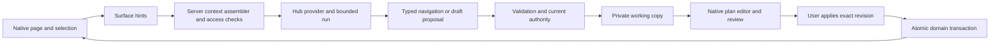

# BOT-82: an agent alongside the learner workspace

Planning proposal · 9 September 2026 · implementation has not started.

The owner confirmed learner workspace first and structured page awareness first. The supplied Base44 image is the primary visual reference; the two attached conversations are inspiration, not technical specifications. This plan covers the companion through native plan co-creation, with other feature editing as a subsequent expansion.

## Recommendation

Build a persistent Hub companion outside the application canvas. Keep the same conversation while the learner uses the real app. Start with read-only, permission-checked page context. Add deliberate navigation next, then a native Plans working copy that both the learner and agent can edit before the learner applies changes.

Use a custom shell and the existing React/FastAPI application boundaries. A new agent framework is not required for the first release. Separate three concerns: conversation continuity, current surface context, and proposed domain operations. The app owns saved facts and permissions; the model proposes text and operations.

Recommend a new epic, **Co-create in the learner workspace with the Hub companion**. Keep BOT-64 as the broader Hub initiative and BOT-82 as the first confirmed personal-plan creation Story under the proposed epic. Shell/awareness should be separate Stories that can ship first. See [proposed backlog](backlog.md). This is a proposed hierarchy, not a Jira migration or implementation authorization.

## What exists, and what actually needs building

Repository inspection is the basis for these findings; runtime behavior has not been exercised in this planning task.

| Existing boundary | Evidence in this repository | Consequence |
|---|---|---|
| Durable conversations, history, resource context, memory | `apps/web/app/orgs/[orgslug]/(withmenu)/hub/HubExperience.tsx`; `apps/api/src/services/hub_conversations.py`; `apps/api/src/routers/hub.py` | Extract the current conversation controller into a shared owner. Preserve existing thread IDs, receipts, archive/delete behavior, and deterministic search. Do not create a separate companion chat history. |
| Hub state currently lives in its page component | `HubExperience.tsx` owns messages, composer, conversation selection and resource state | Route continuity is a real refactor, not just positioning the existing page in a sidebar. |
| Shared learner shell with app menu and right sidebar portal | `apps/web/app/orgs/[orgslug]/(withmenu)/layout.tsx` | Mount one companion owner here, keyed by authenticated user and organization. Account for Plans' existing right sidebar, mobile navigation, dialogs and podcast player. Admin and guest layouts are distinct. |
| Plans selection sometimes uses browser history directly | `apps/web/components/Plans/PlansWorkspace.tsx` | Route parsing alone cannot describe the active plan/objective. Surface adapters must publish component state and support browser Back/Forward. |
| Native plan fields, phases, objectives, dates and capability checks | `apps/web/components/Plans/PlanEditorShared.tsx`; `PlansWorkspace.tsx`; `apps/api/src/services/planning.py` | Reuse the editor and domain rules. The later working-copy mode needs an editor data/command adapter, not a second plan component in chat. |
| Immediate plan writes | `create_plan`, `update_plan`, phase/objective mutations in `planning.py` commit individually | Batch apply needs transaction-safe domain commands. Calling current endpoints in a loop would allow partial plans. |
| No dedicated co-creation draft or integer revision in Plan | `apps/api/src/db/planning.py` | Add separate working-copy/change-set records and concurrency control. Existing `pending` status is not an AI draft. |
| Completion dates and shared assignment rules | `create_plan`, `update_plan`, `_require_individual_definition` | An incomplete draft may omit dates; applying it must satisfy current date validation. Group definition edits belong to the group workspace and must not be smuggled through personal-plan tools. |
| Two text provider adapters | `apps/api/src/services/hub_advisor.py` has OpenAI Responses and Anthropic Messages; OpenAI currently sends `tools: []`, `tool_choice: none` | Read-only awareness can use bounded grounding with current adapters. Actions require a new provider-neutral tool/run contract. No provider/model change is assumed. |
| Current advice endpoint also persists messages and may extract memory | `apps/api/src/routers/hub.py:create_hub_advice` | “Read-only” means no plan/navigation/domain actions. Existing intentional conversation persistence remains. Never feed surface snapshots into automatic long-term memory extraction. |
| Grounding already planned | BOT-122 and its deliverables BOT-123/124/125 | Reuse its bounded server assembler and plan provider. First awareness release depends on BOT-123/124, not on every later grounding provider. |
| Adjacent work | BOT-77 resource grounding; BOT-108 Library; BOT-109 resource context; BOT-126 organization knowledge; BOT-79 governance | Coordinate receipts/resource views. Organization document retrieval and a full AI operations console need not block the first companion. |

The search covered personal/group/template/admin plan surfaces, planning services and router guards, legacy-plan resolution, the current Hub, and old `copilot`/journey route names. A `copilot` full-bleed exception survives in the layout but no matching page was found. Avoid building on that name as evidence of a second active agent. Subscription `services/plans` is separate from learner `services/planning`.

Product context: `PATHWAYS-G006-A001` guidance; `A002` conversation continuity; `A004` review a suggested action (planned); `A006` resource conversation; `PATHWAYS-G001-A002/A003` inspect/create personal plans; `PATHWAYS-G003-A006` adapt an individual live plan. No new durable Activity is needed simply to describe a sidebar. Some older guidance acceptance text still describes ephemeral reload behavior; reconcile it with BOT-81 and actual history behavior during implementation, without erasing historical signoff.

## Research and build-versus-adopt decision

| Source | What it establishes | Application to this build |
|---|---|---|
| [Base44 AI chat documentation](https://docs.base44.com/Building-your-app/AI-chat-modes) | Base44 separates discussion, building and visual selection. | Borrow the supplied screenshot's framing and conversation continuity. Preserve Launch's existing single composer; no Build/Discuss mode picker is needed for release one. |
| [Next.js layouts](https://nextjs.org/docs/app/getting-started/layouts-and-pages) | Shared layouts preserve state through navigation. | Put conversation ownership above learner pages. Still explicitly restore after full reload and reset across auth/tenant boundaries. |
| [CopilotKit reference](https://docs.copilotkit.ai/reference) | Offers context, frontend tool, human-input, thread and rendering hooks. | Credible adoption candidate for later orchestration. It would still require Launch-specific context filtering, permissions, draft persistence and conflict handling. |
| [AG-UI state](https://docs.ag-ui.com/concepts/state) and [events](https://docs.ag-ui.com/concepts/events) | Defines snapshots/deltas and agent lifecycle/message/tool events. | Useful vocabulary for a typed event stream; state synchronization alone does not make a database edit authorized or transactional. |
| [OpenAI function calling](https://developers.openai.com/api/docs/guides/function-calling) | Applications execute requested functions; strict schemas constrain arguments. | Use bounded typed domain proposals when actions arrive. Validate authority, versions and meaning separately on the server. Schema validity is not permission. |
| [WAI-ARIA window splitter](https://www.w3.org/WAI/ARIA/apg/patterns/windowsplitter/) | Describes keyboard operation and separator semantics for resizable panes; the page notes its example/review limitations. | Build and test accessible resizing, plus a simple collapse/expand control. Do not rely on dragging as the only mechanism. |

**Engineering judgment:** extend the existing stack for the first slice. Before navigation, run a bounded integration spike comparing our small typed run/event layer against CopilotKit/AG-UI. Adoption must preserve FastAPI services, both configured provider paths, existing Hub thread ownership, custom outer shell and server-enforced approvals without a second authoritative state store. Evaluate actual integration code, dependency cost and recovery behavior; do not adopt just because the demo resembles the desired UI. A provider adapter unable to support actions should explicitly remain read-only.

Pixel-based computer use, arbitrary DOM extraction, generated React, and a remote browser agent add no necessary capability to the confirmed first slice. Structured surface data answers what item is open; it cannot judge visual spacing, unseen embedded content or arbitrary page appearance. State that limitation in the UI.

## Interaction contract

Three presentation states share one conversation: full Hub, companion beside the app, and tucked-away launcher. These are layout states, not different agents or permission modes. Desktop default: companion left, existing app navigation and page inside one frame to the right. Narrow layouts use an overlay/full-screen conversation with a clear return-to-page control.

Opening the companion is intentional; thereafter it follows the learner's navigation. Hiding preserves the thread but initiates no background messages or new context transmission. Returning to Hub expands that thread. Starting a new chat clears prior conversation attachments and selections; the new thread uses the current supported page when the learner sends. Switching user or organization clears surface state and pending effects and restores only an authorized thread in the new scope. Resume after reload rechecks access. Unsupported pages preserve chat and show a compact header status with help text explaining the boundary.

Keep supported page awareness out of the way during ordinary use. When the open page has no context provider, show only **I can't read this page yet** in the companion header with a help icon explaining that Hub can use saved details from supported learner pages, but cannot see unsaved text or the visual screen. Preserve a selected objective when the companion opens and identify the submitted target in the message receipt. Clear page selection on departure; any deliberately attached reference remains labeled separately from the current page. Release one has single-object targeting, not persistent multi-object pinning.

The first release follows user navigation only. It answers “What is this objective asking me to do?” using the registered selection; it can explain that editing isn't available yet. It must not claim to have changed something. Existing user-clicked resource links remain functional. It makes no unsolicited comments after scrolls, selections or edits.

## Structured awareness contract

Two distinct inputs meet at the server:

1. **Browser attention hints:** surface type, entity ID, selected object ID, current tab, visible object IDs, filter/sort state, active dialog type, context generation and dirty-field identifiers. These indicate what the learner means, not authoritative facts or permissions.
2. **Authoritative context:** server reloads the accessible entity through its owning services, applies viewer/field permissions, relevance and limits, and produces a bounded BOT-122 context bundle and source receipt.

Proposed client envelope (design contract, not an existing API):

```ts
type SurfaceHint = {
  schemaVersion: 1;
  surface: 'plans-list' | 'plan-detail' | 'hub-resource' | 'unsupported';
  instanceId: string;
  generation: number;
  entityId?: string;
  selectedObjectId?: string;
  visibleObjectIds: string[];
  tab?: string;
  dirtyFieldIds: string[];
  sharedDraftText?: { fieldId: string; text: string };
};
```

Register/unregister adapters through the shared provider. Use semantic IDs from existing components, intersection observation for actually displayed rows, and explicit selection/open-panel state. Exclude collapsed, unloaded, occluded and virtualized-offscreen content from the “visible” label. Visibility is approximate semantic attention, not a screenshot claim. Server-enriched offscreen facts may be useful but must be labeled as plan context, not items currently in view. Prefer selected content, then visible summaries, then relevant broader facts. Unresolved “this” prompts clarification.

Capture one immutable context generation on Send. Resolve references and permissions then; do not call the model on every keystroke or scroll. Starting budget proposal: at most 20 visible IDs, one selected object, 4,000 characters of explicitly shared draft text and roughly 2,000 tokens of live-page grounding; measure and tune. Truncation is explicit. The client is never trusted to supply its capabilities, canonical plan JSON, or server source receipts.

Unsaved text is opt-in per field with **Include my unsaved text**. The ordinary answer uses saved values and mentions unsaved differences when relevant. Shared draft text is labeled user-provided, unverified and request-scoped; it cannot overwrite server facts. This is a new input channel alongside BOT-122's server-owned context, not an exception allowing the client to rewrite derived context.

Plans are personal and may be visible across organizations, while Hub threads are organization-scoped. For the first release, allow the explicitly opened accessible plan in the active thread, plus relevant independent/current-organization facts under BOT-122 policy. Do not pull unrelated other-organization records. An institution's role must not gain access to a private conversation merely because it supplied the plan. Test this intersection explicitly.

Page text, resource titles and saved descriptions are untrusted data. They cannot override agent instructions, authorize tools or widen retrieval. Never capture credentials, general form contents, hidden DOM, reviewer-only information, browser history or arbitrary external-page text. A resource's metadata does not imply access to its PDF/video/iframe contents.

Answers carry a server-generated receipt of sources actually supplied, their freshness and selection status. Recheck access when resolving receipt links. Avoid raw context in operational logs. Do not copy surface context into durable learner memory; context removal prevents future retrieval but cannot make already-written conversation prose unseen. Preserve current conversation deletion controls and document retention behavior.

## Navigation and action architecture



Navigation tools resolve allowlisted routes and entity IDs through existing organization-aware routing helpers. Never accept model-authored arbitrary URLs, CSS selectors or JavaScript. Proposed initial effects: open an accessible plan/resource and reveal a registered objective. Require a direct user request or accepted navigation suggestion; guard unsaved editors. Bind effects to initiating user, organization, thread, tab, surface generation and run. Drop late effects after the learner changes page or conversation; acknowledge actual navigation before the agent says it happened. Back/Forward, focus restoration and reduced motion are part of delivery.

Before tools, introduce `run_id`, client request idempotency and typed lifecycle events: started, text, proposal-ready, awaiting-review, completed, failed, cancelled. Server persistence owns terminal state; event replay is sequenced/deduplicated. Cancellation stops further effects, never pretends to roll back an already committed transaction. Network abort alone does not guarantee a backend task stopped. Release one may retain request/response generation, but must guard late responses and preserve the submitted draft on failure. Streaming can arrive with the run layer; WebSockets are not a prerequisite.

## Co-creation and persistence

Start with independent personal plans. Add a private `PlanWorkingCopy` and `PlanChangeSet` design containing owner/thread scope, optional base plan, base revision, draft revision, typed operations, actor attribution, validation results, status and timestamps. Private recovery saves are clearly labeled **Draft saved · not applied to plan**. Drafts do not enter live feeds, progress, assignments, notifications or collaborator views. Define discard and expiry policy before shipping (proposed 30-day inactive retention with disclosure); conversation deletion must offer an explicit draft-handling choice, not orphan inaccessible work.

The existing native editor gets a command/data adapter for working-copy mode. Manual and agent edits enter the same draft reducer/service. Each agent response produces one reviewable operation batch; the user can revise or reject it. User-edited fields are not overwritten by a late batch: compare the referenced draft revision and show a conflict. Stream prose if useful, but stage only complete validated operation batches, never partial JSON fields.

Initial operations: propose plan name/description/dates, add/update/remove/reorder phases, and add/update/remove/reorder custom objective definitions. Only supported current fields are generated. New drafts can be incomplete; **Create plan** validates required dates and hierarchy. Reuse existing kind/step validation; badge requirements and attachments arrive after basic structure, using accessible canonical IDs. Do not generate fictional badges or assume arbitrary resource references already have a native attachment representation.

For an existing personal plan, fork a base revision and show an in-place preview with before/after access and one **Apply changes** action. Accepting a suggestion into the draft and applying to the saved plan are visibly different. Approval binds authenticated user, exact operation set and revision; editing invalidates the old approval. Models can propose/revise, but cannot manufacture approval or call an unguarded commit tool.

Add a monotonic structure revision and require it on every definition-writing path, including ordinary UI and group/template propagation where applicable. Audit all writers before enabling editing: a token checked only by the agent endpoint cannot prevent lost updates. Use transactional compare-and-swap/locking appropriate to the shared aggregate. Track working-copy revisions separately; progress updates need not conflict with a title-only proposal unless that progress affects validation.

Refactor current committing service functions into shared validation/command helpers under a caller-owned transaction. Revalidate capabilities and all affected IDs/dates; apply the reviewed batch and activity record atomically. Enforce one result per idempotency key. On retry after connection loss, retrieve that result instead of creating a duplicate. Re-read saved state and invalidate affected SWR keys before saying changes are complete.

Undo within a draft is normal operation history. After apply, offer **Review reversal** only where an inverse patch is safe against current versions and permissions. Never restore an entire old plan over collaborators' later work. Initial tools do not change ownership, invite collaborators, publish templates, complete/review objectives, archive/delete plans or send messages. Those are separate consequential capabilities. Preserve BOT-82's existing direction: Notes proposals require an explicit useful learner statement and confirmed action; no silent private Note writes.

## Delivery sequence and release gates

| Phase | Deliverable and dependencies | Gate before proceeding |
|---|---|---|
| 0 — Design and contracts | Owner concept pack; native shell prototype; surface schema; provider integration spike scoped before phase 2 | Approve spatial hierarchy and mobile return behavior; settle awareness disclosure. |
| 1 — Companion that understands the current page | Shared conversation owner, desktop/mobile shell, plan list/detail + Hub resource adapters, BOT-123/124 grounding, current-source receipt and unsaved-text opt-in | Same thread and composer survive navigation; accurate selected-object answers; unsupported pages honest; no navigation or plan writes. |
| 2 — Help the learner navigate | Bounded run/events, cancellation/retry, allowlisted navigation/reveal and unsaved-change guard | No late route hijacks; actual target acknowledged; user Back/Forward and Stop work. |
| 3 — Create a personal plan together (BOT-82) | Native working copy, typed proposals, shared manual edits, revision checks, review/create transaction, recovery/history | Incomplete draft survives reload; edits remain private until Create; repeated apply creates one valid plan; attribution and draft undo work. |
| 4 — Revise an existing personal plan | Before/after preview, all-writer concurrency, atomic apply and safe reversal | Concurrent manual edits and permission loss never cause silent overwrite; rejected proposals never affect saved plan. |
| 5 — Extend capabilities deliberately | Accessible badge/resource targets, then separately scoped Notes/portfolio/group/admin support | Each surface/action has its own permission, review, recovery and owner-test contract. No universal “edit app” tool. |

Planning estimates, not delivery promises: phase 0 about 2–4 engineering days plus owner concept iteration; phase 1 about 8–14 days including the minimum BOT-122 foundation; phase 2 about 4–7; phase 3 about 8–14; phase 4 about 6–10. Approximately 28–49 engineering days through personal-plan creation/editing, excluding design waiting time and broader phase 5. Refine after shell extraction and transaction spikes; editor coupling, context isolation and all-writer concurrency are the largest uncertainties. No assumption of parallel staff or a fixed calendar commitment.

## Verification, observability and rollout

Each Story must pass its relevant checks before In Review. Implementation tests should prove behavior, not duplicate reducers line-for-line.

* Browser journeys: full Hub → personal plan → objective → resource → Hub, hide/reopen, reload, Back/Forward, new thread, archived/deleted thread, org/user switch. Confirm composer/resource receipts survive correctly and stale selections do not.
* Context contract: spoofed/foreign IDs, restricted fields, selected offscreen item, collapsed/virtualized content, unknown page, revoked access, dirty text not shared/shared, page changed mid-answer and injection in plan/resource text. Inspect captured provider payloads, not only model prose.
* Model evaluation set: representative “this”/“next”/ambiguous/resource-seeking prompts, contextual explanation, unrelated request and edit request in read-only mode. Both configured provider paths must show useful grounding and honest limitations; authority tests are deterministic server assertions.
* Draft/apply: validation, invalid dates, group guard, user edits during generation, second-tab/collaborator change, role revocation, duplicate approval, replay after disconnect, transactional failure midway, safe reversal, expiry/discard. Migration up/down/upgrade-from-current fixtures and existing planning regression tests.
* UI: 320/390/768/1024/1440/1920 widths, keyboard-only operation, screen reader status and focus, 200% zoom and narrow reflow, software keyboard, independent scrolling, nested dialogs, bottom navigation/player, tenant accents, dark/light and reduced motion. Catalog additions need a native design-system preview. Call ESLint directly: current `npm run lint` masks failures with `|| true`.

Relevant existing suites: `apps/api/src/tests/test_hub_advisor.py`, `test_hub_conversations.py`, `test_hub_memory.py`, `test_planning.py`; `apps/web/services/hub/__tests__/interaction.test.ts`; web `test:routing`, TypeScript and production build. Add browser coverage for cross-page state, which unit tests cannot establish.

Instrument bounded context size, source rejection reason, stale-context drops, time to answer, provider failures, run cancellation, proposal acceptance/rejection, conflict rate and duplicate-commit prevention. Exclude raw plan text from ordinary analytics. Performance budgets are provisional until measured: no model calls from passive navigation and a responsive shell independent of advisor availability.

Roll out behind separate shell, awareness, navigation and plan-proposal flags; start internal/unstable and then an opt-in learner cohort. Keep existing Hub available when companion flags are disabled. A kill switch removes tools and rejects new applies server-side; pending drafts stay readable/recoverable under their owner. Do not require BOT-79's whole dashboard to supply basic request limits and monitoring. Record owner review separately from automated success.

## Remaining product decisions

Confirmed: learner-first, structured awareness, Base44-like outer companion, awareness before navigation/editing.

Proposed defaults to review through concepts: right dock; phone full-screen expansion from a compact launcher; current supported page included automatically when the learner sends; unsaved text shared explicitly; private recoverable drafts; batch review before saved-plan mutation. No decision here enables unattended writes.

Before drafting ships, settle draft retention/deletion, whether to retain the current mandatory completion date at final creation (recommended), and precise policy for cross-organization plan context. Before phase 5, choose the next actual user outcome; Notes, portfolio publishing and group administration are separate expansions rather than promises hidden inside BOT-82.
