# BOT-82: an agent alongside the learner workspace

Living delivery plan · updated 10 September 2026.

BOT-156 has delivered the persistent companion and permission-checked personal/group-plan awareness and is In Review. BOT-159 has delivered consistent page-title/location provenance and is In Review. BOT-163 Phase 2 is implemented and browser-verified at desktop and phone widths. BOT-82 Phase 3 is now In Progress, and the remaining co-creation expansion is represented by BOT-174, BOT-179, BOT-184, BOT-189, BOT-79 and BOT-194. The native new-plan, phase and phase-targeted objective proposal paths are implemented with independent object review; Hub still cannot directly save a plan or portfolio change.

The owner confirmed learner workspace first and structured page awareness first. The supplied Base44 image is the primary visual reference; the two attached conversations are inspiration, not technical specifications. This plan covers the companion through native plan co-creation, with other feature editing as a subsequent expansion.

## Recommendation

Build next around native object-level edit mode in the Plans workspace. The learner should experience Hub opening the real plan and helping edit it, not entering a separate draft or version-management product. Recovery records, base revisions, proposal provenance and idempotency remain implementation details beneath that familiar interaction. Establish the object-edit contract once in BOT-82, then reuse it through increasingly consequential domain Stories rather than building one universal agent tool.

Use a custom shell and the existing React/FastAPI application boundaries. A new agent framework is not required for the first release. Separate three concerns: conversation continuity, current surface context, and proposed domain operations. The app owns saved facts and permissions; the model proposes text and operations.

Keep BOT-64 as the broader Hub initiative. BOT-156 owns the delivered shell/awareness slice, BOT-159 owns shared location provenance, BOT-163 owns learner-controlled navigation, BOT-82 owns the reusable run/draft/confirmation foundation through personal-plan creation, and later Stories own their domain-specific authority. See [delivery backlog](backlog.md).

The companion is the beginning of a co-creating agent, not a collection of unrelated links. Its first useful act is often good advice followed by an appropriate place to continue. The same proposal envelope introduced for navigation should later carry a scoped edit grant, a cancellable goal-directed run and typed object operations without granting the model direct application authority.

## What exists, and what actually needs building

This inventory began as repository inspection and now also records delivered BOT-156/159 behavior. Rows describing missing work should be read together with the delivery sequence below.

| Existing boundary | Evidence in this repository | Consequence |
|---|---|---|
| Durable conversations, history, resource context, memory | `apps/web/app/orgs/[orgslug]/(withmenu)/hub/HubExperience.tsx`; `apps/api/src/services/hub_conversations.py`; `apps/api/src/routers/hub.py` | Extract the current conversation controller into a shared owner. Preserve existing thread IDs, receipts, archive/delete behavior, and deterministic search. Do not create a separate companion chat history. |
| Shared conversation owner is delivered | `HubExperience.tsx`; `apps/web/components/Hub/HubWorkspace.tsx` | The same mounted controller now owns messages, composer, thread selection and resource state across full/companion/tucked layouts. Preserve this boundary for every later capability. |
| Shared learner shell hosts the companion | `apps/web/app/orgs/[orgslug]/(withmenu)/layout.tsx`; `HubWorkspace.tsx` | It is keyed by the authenticated organization experience and already accounts for compact navigation, mobile focus/inert behavior and Plans' panel. Admin and guest layouts remain distinct. |
| Plans publishes structured attention | `apps/web/components/Plans/PlansWorkspace.tsx`; `apps/api/src/services/hub_context.py` | Personal/group plan and selected-object identifiers are revalidated server-side. Browser Back/Forward and query-selected group plans retain the intended context. |
| Native plan fields, phases, objectives, dates and capability checks | `apps/web/components/Plans/PlanEditorShared.tsx`; `PlansWorkspace.tsx`; `apps/api/src/services/planning.py` | Reuse the editor and domain rules. The later working-copy mode needs an editor data/command adapter, not a second plan component in chat. |
| Immediate plan writes | `create_plan`, `update_plan`, phase/objective mutations in `planning.py` commit individually | Batch apply needs transaction-safe domain commands. Calling current endpoints in a loop would allow partial plans. |
| Native editors originally had no recoverable unsaved state or integer revision in Plan | `apps/api/src/db/planning.py`; `apps/api/src/db/hub.py` | Private run-scoped object recovery now supports the initial editor without becoming a visible draft product. Add aggregate concurrency control before existing-plan edits. Existing `pending` status is unrelated. |
| Completion dates and shared assignment rules | `create_plan`, `update_plan`, `_require_individual_definition` | An incomplete draft may omit dates; applying it must satisfy current date validation. Group definition edits belong to the group workspace and must not be smuggled through personal-plan tools. |
| Two provider adapters now share one proposal capability | `apps/api/src/services/hub_advisor.py`; `apps/api/src/services/hub_actions.py` | OpenAI Responses and Anthropic Messages receive equivalent `suggest_navigation` schemas. Provider output is a proposal only; the server owns labels, persistence, permissions and routes. |
| Advice persists messages, receipts, memories and inert proposals | `apps/api/src/routers/hub.py:create_hub_advice`; `hub_conversations.py` | Navigation proposals survive reload with their assistant message. They remain separate from memory and have no effect until their owner clicks and the server revalidates them. |
| Grounding already planned | BOT-122 and its deliverables BOT-123/124/125 | Reuse its bounded server assembler and plan provider. First awareness release depends on BOT-123/124, not on every later grounding provider. |
| Adjacent work | BOT-77 resource grounding; BOT-108 Library; BOT-109 resource context; BOT-126 organization knowledge; BOT-79 governance | Coordinate receipts/resource views. Organization document retrieval and a full AI operations console need not block the first companion. |

The search covered personal/group/template/admin plan surfaces, planning services and router guards, legacy-plan resolution, the current Hub, and old `copilot`/journey route names. A `copilot` full-bleed exception survives in the layout but no matching page was found. Avoid building on that name as evidence of a second active agent. Subscription `services/plans` is separate from learner `services/planning`.

Product context: `PATHWAYS-G006-A001` guidance; `A002` conversation continuity; `A004` review a suggested action (planned); `A006` resource conversation; `PATHWAYS-G001-A002/A003` inspect/create personal plans; `PATHWAYS-G003-A006` adapt an individual live plan. No new durable Activity is needed simply to describe a sidebar. Some older guidance acceptance text still describes ephemeral reload behavior; reconcile it with BOT-81 and actual history behavior during implementation, without erasing historical signoff.

## Research and build-versus-adopt decision

| Source | What it establishes | Application to this build |
|---|---|---|
| [Base44 AI chat documentation](https://docs.base44.com/Building-your-app/AI-chat-modes) | Base44 separates discussion, building and visual selection. | Borrow the supplied screenshot's framing and conversation continuity. Preserve Launch's existing single composer; no Build/Discuss mode picker is needed for release one. |
| [Next.js layouts](https://nextjs.org/docs/app/getting-started/layouts-and-pages) | Shared layouts preserve state through navigation. | Put conversation ownership above learner pages. Still explicitly restore after full reload and reset across auth/tenant boundaries. |
| [CopilotKit reference](https://docs.copilotkit.ai/reference) | Offers context, frontend tool, human-input, thread and rendering hooks. | Credible adoption candidate for later orchestration. It would still require Launch-specific context filtering, permissions, draft persistence and conflict handling. |
| [AG-UI state](https://docs.ag-ui.com/concepts/state) and [events](https://docs.ag-ui.com/concepts/events) | Defines snapshots/deltas and agent lifecycle/message/tool events. | Useful vocabulary for a typed event stream; state synchronization alone does not make a database edit authorized or transactional. |
| [OpenAI function calling](https://developers.openai.com/api/docs/guides/function-calling) | Applications execute requested functions; strict schemas constrain arguments. | Use bounded typed domain proposals when actions arrive. Validate authority, versions and meaning separately on the server. Schema validity is not permission. |
| [WAI-ARIA window splitter](https://www.w3.org/WAI/ARIA/apg/patterns/windowsplitter/) | Describes keyboard operation and separator semantics for resizable panes; the page notes its example/review limitations. | Build and test accessible resizing, plus a simple collapse/expand control. Do not rely on dragging as the only mechanism. |

**Engineering judgment:** extend the existing stack for the first slice. Before navigation, run a bounded integration spike comparing our small typed run/event layer against CopilotKit/AG-UI. Adoption must preserve FastAPI services, both configured provider paths, existing Hub thread ownership, custom outer shell and server-enforced approvals without a second authoritative state store. Evaluate actual integration code, dependency cost and recovery behavior; do not adopt just because the demo resembles the desired UI. A provider adapter unable to support actions should explicitly remain read-only.

Pixel-based computer use, arbitrary DOM extraction, generated React, and a remote browser agent add no necessary capability to the confirmed first slice. Structured surface data answers what item is open; it cannot judge visual spacing, unseen embedded content or arbitrary page appearance. State that limitation in the UI.

## Interaction contract

Three presentation states share one conversation: full Hub, companion beside the app, and tucked-away launcher. These are layout states, not different agents or permission modes. The delivered desktop direction places the application in an inset frame with the companion on the right. Narrow layouts use a focus-managed drawer with a clear return-to-page control.

Opening the companion is intentional; thereafter it follows the learner's navigation. Hiding preserves the thread but initiates no background messages or new context transmission. Returning to Hub expands that thread. Starting a new chat clears prior conversation attachments and selections; the new thread uses the current supported page when the learner sends. Switching user or organization clears surface state and pending effects and restores only an authorized thread in the new scope. Resume after reload rechecks access. Unsupported pages preserve chat and show a compact header status with help text explaining the boundary.

Keep supported page awareness out of the way during ordinary use. Supported saved-page context is captured automatically on Send. When the open page has no context provider, show only **I can't read this page yet** in the companion header with a help icon explaining that Hub can use saved details from supported learner pages, but cannot see unsaved text or the visual screen. Preserve a selected objective when the companion opens and identify the submitted target in the message receipt. Clear page selection on departure; any deliberately attached reference remains labeled separately from the current page. Release one has single-object targeting, not persistent multi-object pinning.

The awareness release follows user navigation only. Phase 2 may suggest where to continue, but never changes route until the learner activates a post-response action. It answers “What is this objective asking me to do?” using the registered selection; it can explain that editing isn't available yet. It must not claim to have changed something. Existing user-clicked resource links remain functional. It makes no unsolicited comments after scrolls, selections or edits.

## Structured awareness contract

Two distinct inputs meet at the server:

1. **Browser attention hints:** surface type, entity ID, selected object ID, current tab, visible object IDs, filter/sort state, active dialog type, context generation and dirty-field identifiers. These indicate what the learner means, not authoritative facts or permissions.
2. **Authoritative context:** server reloads the accessible entity through its owning services, applies viewer/field permissions, relevance and limits, and produces a bounded BOT-122 context bundle and source receipt.

Current client envelope (implemented first slice):

```ts
type HubSurfaceHint = {
  surface: 'plan' | 'plans' | 'group_plan' | 'unsupported';
  entity_id?: string;
  selected_objective_id?: string;
  visible_ids?: string[];
  page_path?: string;
  page_title?: string;
};
```

Register/unregister adapters through the shared provider. Use semantic IDs from existing components, intersection observation for actually displayed rows, and explicit selection/open-panel state. Exclude collapsed, unloaded, occluded and virtualized-offscreen content from the “visible” label. Visibility is approximate semantic attention, not a screenshot claim. Server-enriched offscreen facts may be useful but must be labeled as plan context, not items currently in view. Prefer selected content, then visible summaries, then relevant broader facts. Unresolved “this” prompts clarification.

Capture an immutable page/location receipt on Send. Resolve references and permissions then; do not call the model on every keystroke or scroll. The current bound is at most 20 visible IDs and one selected objective. Explicitly sharing unsaved draft text is deferred; when added it remains request-scoped and bounded to 4,000 characters. The client is never trusted to supply its capabilities, canonical plan JSON, server source receipts or navigation routes.

Unsaved text is opt-in per field with **Include my unsaved text**. The ordinary answer uses saved values and mentions unsaved differences when relevant. Shared draft text is labeled user-provided, unverified and request-scoped; it cannot overwrite server facts. This is a new input channel alongside BOT-122's server-owned context, not an exception allowing the client to rewrite derived context.

Plans are personal and may be visible across organizations, while Hub threads are organization-scoped. For the first release, allow the explicitly opened accessible plan in the active thread, plus relevant independent/current-organization facts under BOT-122 policy. Do not pull unrelated other-organization records. An institution's role must not gain access to a private conversation merely because it supplied the plan. Test this intersection explicitly.

Page text, resource titles and saved descriptions are untrusted data. They cannot override agent instructions, authorize tools or widen retrieval. Never capture credentials, general form contents, hidden DOM, reviewer-only information, browser history or arbitrary external-page text. A resource's metadata does not imply access to its PDF/video/iframe contents.

Answers carry a server-generated receipt of sources actually supplied, their freshness and selection status. Recheck access when resolving receipt links. Avoid raw context in operational logs. Do not copy surface context into durable learner memory; context removal prevents future retrieval but cannot make already-written conversation prose unseen. Preserve current conversation deletion controls and document retention behavior.

## Navigation and action architecture (BOT-163)

```mermaid
flowchart LR
  UI[Native page and selection] --> H[Surface hints]
  H --> C[Server context assembler and access checks]
  C --> A[Hub provider and bounded response]
  A --> P[Typed capability proposal]
  P --> M[Persist with assistant message]
  M --> B[Learner action button]
  B --> V[Revalidate owner destination and authority]
  V --> D[Navigation now; native edit suggestions later]
  D --> E[Native plan editor and review]
  E --> U[User saves the visible object]
  U --> T[Atomic domain transaction]
  T --> UI
```



The model does not navigate and does not author URLs. It may emit a bounded `suggest_navigation` proposal after its natural-language answer. The server validates the proposal against a code-owned capability registry, persists the semantic destination with the assistant message, and returns a display-safe action. The learner chooses whether and when to activate it. On activation the server rechecks message ownership, organization membership, enabled product features, entity access and the current route resolver, then returns the organization-aware route. The client navigates only after that successful resolution and keeps the companion mounted.

Initial semantic destinations cover the main learner value surfaces: Hub, Plans, starting a personal plan, Portfolio, adding a Timeline experience, Badges, Communities, Programs/resources and Account. Entity-specific plan, badge and resource targets are added only when their canonical IDs came from authoritative accessible context; invalid or invented IDs produce no action. The registry is designed to grow into reveal-object, working-copy and confirmed-apply capabilities without exposing arbitrary URLs, CSS selectors or JavaScript.

Platform superadmins already own one provider-independent Hub instruction set. Present that surface as platform guidance: it tunes voice, priorities, when to suggest a next action and which learner outcomes deserve emphasis. Each capability separately owns its schema, description, permission checks and execution rules in application code. Runtime composition supplies both to every provider. Editable guidance cannot alter schemas, grant access, auto-execute an action or weaken the click requirement. Future administration may add capability enablement and per-capability guidance, but Phase 2 does not duplicate prompts per provider or turn safety policy into free-form configuration.

Phase 2 deliberately uses post-response action controls rather than turning every noun in prose into a link. A response may mention several ideas while recommending one useful continuation. Keep the prose readable; render a compact Confluence-like action row after the message, with a verb-first label and enough context to predict the destination. Repeated/resumed conversations show the same persisted proposal. No action is rendered for weak, irrelevant or invalid suggestions, and the assistant must not claim navigation occurred.

Phase 2 may retain the current request/response transport because navigation is inert until a later click. Its persisted proposal envelope must nevertheless carry a stable action ID, capability key, schema version, semantic arguments and creation state so future runs can add `run_id`, idempotency and typed lifecycle events without changing transcript ownership. Streaming and WebSockets are not prerequisites. Consequential later tools still require proposal-ready, awaiting-review, completed, failed and cancelled lifecycle semantics.

Phase 3 actions use a true split button. Activating the main **Work on this plan** area revalidates the destination, navigates there and grants Hub a visible, narrowly scoped edit run. The arrow segment opens alternatives such as **Open plan without editing**; it never activates the primary action. While granted, the companion header area that otherwise reports awareness limitations shows **Editing: [plan]** and a revoke control. A changed goal is allowed when established in conversation, but the run always has one current explicit goal; widening to another plan or a more consequential capability requires another learner action.

The composer send arrow becomes a Stop control whenever an answer or tool run is active. Stop is a general conversation control, not an edit-mode feature: it cancels provider generation, prevents unstarted operations and asks in-flight operations to settle safely. It does not discard already prepared unsaved object edits.

Editing progresses through semantic events rather than a polling watcher. Granting scope, saving or cancelling an object, answering a question and resolving a review each become a user-intent turn in the same conversation. Object decisions include the final visible values and whether each Hub proposal was accepted, customized or rejected. The orchestrator consumes that event and continues until its next explicit boundary: another supported edit, a clear question awaiting the learner, or a proposed conclusion. Closing the companion may hide the response but does not suppress continuation caused by a deliberate object action. A bare acknowledgement is not a valid stopping state.

Implementation checkpoint: object decisions enter a per-owner, per-organization, thread/run-scoped continuation queue. The queue drains in order, remains available across a same-tab reload, and removes an item only after the advisor response succeeds. Objective creation uses a deterministic request key so a lost response can retrieve the same result instead of creating a duplicate. Server-side delivery leasing and cross-device recovery remain future hardening; the durable run event and object state remain the source for reconstructing work.

Run events render like a restrained coding-agent activity stream. Transient inspection events may disappear or collapse; durable domain outcomes remain addressable and may condense into summaries such as **Edited 3 objectives**. Activating an object reference navigates or scrolls to the native object and gives it one calm outline pulse. Pointing remains available from conversation history while the object exists and remains accessible. A compact review tray slides down from above the composer when objects need attention, showing the outstanding count, **Review next**, and a cancel-all escape hatch. It is a locator, not a second review surface.

When the goal appears satisfied, Hub proposes **Finish this edit** through the same persisted action mechanism used to begin. The learner decides whether to conclude. Finishing revokes the grant and collapses completed activity, but never silently saves or cancels an object still in edit mode.

## Co-creation and persistence

Start with independent personal plans and make ordinary object-level editing the product contract. The agent and learner use the same native fields and the same object-level **Save** and **Cancel** actions. Several objects may remain in edit mode simultaneously. Do not expose drafts, versions, change sets or an agent-only editor; keep the private recovery session, base revisions, typed operations, actor attribution, validation and timestamps behind the interface.

Each object edit retains saved, Hub-proposed and current field values. Hub-touched fields receive a quiet accent. Original/proposed comparison appears on hover or keyboard focus. When the learner changes a proposed value, mark it **Customized** and offer Undo to restore Hub's proposal. **Save** persists exactly the current object state, including unchanged originals and learner customizations; **Cancel** restores the saved object. There is no separate accept-then-apply ceremony.

Before Hub changes a field, the client and server reserve that field for the short mutation window. A learner-focused or dirty field takes precedence and cannot be reserved by Hub; the operation waits, selects another field or reports that it needs attention. Do not lock the whole object while the model thinks. Release a reservation on completion, stop, failure and timeout. Saved writes still require optimistic base-revision checks so another tab or actor cannot be silently overwritten.

Only complete validated field values enter edit state. While a field operation is pending, replace that field with a calm skeleton/shimmer rather than showing partial model output. Once validated, reveal short values quickly character by character; accelerate or chunk long text and honor reduced-motion preferences. The animation is presentation only—never treat partial rendered text as authoritative edit state.

Initial operations: fill plan name/description/dates, then after the learner saves the new plan, add/update/reorder phases and add/update/reorder custom objective definitions. The dependency is visible: Hub creates the plan through the ordinary flow first, and can work on child objects only after the learner confirms it. **Cancel** during initial creation cancels creation. Agent-driven deletion is deferred until tombstone review is built; that later interaction leaves a red placeholder at the object's former position with **Delete** and **Restore**, expandable to inspect the original.

The initial create flow stages structure deliberately: if Hub proposes new phases, it cannot also enqueue objectives that depend on those phases in the same turn. Each phase is independently saved or cancelled first; later objective proposals name a saved phase and expose that assignment as an editable field. Phase and objective creation both carry deterministic request keys, so reviewing objects out of order or retrying a lost response does not duplicate or scramble them.

Private recovery state survives reload for 30 inactive days with disclosure, does not enter live feeds, progress, assignments, notifications or collaborator views, and requires an explicit retain/discard choice when its conversation is deleted. This is described to learners as recovered unsaved editing, not as a separate plan draft.

Add a monotonic structure revision and require it on every definition-writing path, including ordinary UI and group/template propagation where applicable. Audit all writers before enabling editing: a token checked only by the agent endpoint cannot prevent lost updates. Use transactional compare-and-swap/locking appropriate to the shared aggregate. Track working-copy revisions separately; progress updates need not conflict with a title-only proposal unless that progress affects validation.

Refactor current committing service functions into shared validation/command helpers under a caller-owned transaction. Revalidate capabilities and all affected IDs/dates; apply the reviewed batch and activity record atomically. Enforce one result per idempotency key. On retry after connection loss, retrieve that result instead of creating a duplicate. Re-read saved state and invalidate affected SWR keys before saying changes are complete.

Undo before Save is normal object-edit history. After Save, offer **Review reversal** only where an inverse patch is safe against current versions and permissions. Never restore an entire old plan over collaborators' later work. Initial tools do not change ownership, invite collaborators, publish templates, complete/review objectives, archive/delete plans or send messages. Those are separate consequential capabilities. Preserve BOT-82's existing direction: Notes proposals require an explicit useful learner statement and confirmed action; no silent private Note writes.

## Delivery sequence and release gates

| Phase | Deliverable and dependencies | Gate before proceeding |
|---|---|---|
| 0 — Design and contracts | **Mostly delivered.** D01/M02 direction, native shell, surface schema and awareness disclosure are established through BOT-156. Provider-neutral proposal contract is completed in BOT-163 rather than a separate framework spike. | Owner review of BOT-156/159; retain right-dock/mobile-drawer direction. |
| 1 — Companion that understands the current page | **First slice In Review (BOT-156/159).** Shared conversation owner, desktop/mobile shell, personal/group-plan adapters, saved-page receipt and location provenance are delivered. BOT-122/123/124 remain the broader live-progress assembler/providers. | Same thread and composer survive navigation; accurate selected-object answers; unsupported pages honest; no plan writes. |
| 2 — Help the learner navigate (BOT-163) | **Implemented; owner review pending.** Provider-neutral semantic proposals, persisted post-response action controls, server capability registry and click-time route/permission resolution. Platform guidance is editable; capability safety stays code-owned. The optimized app passed normal-login Start a plan, Add to Timeline, rejection, keyboard and mobile-composer browser scenarios. | Owner review plus the first remote mobile WebKit CI result. No automatic or late route hijacks; no model-authored URL; resumed actions remain safe; the companion survives navigation. |
| 3 — Establish native agent-assisted editing and create a personal plan (BOT-82) | Goal-scoped cancellable runs; split action and visible grant; field reservations; native multi-object edit mode; saved/proposed/current provenance; pointing/activity/review tray; plan-first creation; hidden recovery and idempotency | User-active fields are never overwritten; Stop settles safely; unsaved edits survive reload; the learner saves or cancels through ordinary object actions; a new plan exists before Hub adds child objects. |
| 4 — Revise an existing personal plan (BOT-174) | All-writer aggregate revisions, the same native object edit contract, field-aware conflicts, guarded deletes and safe reversal | Concurrent edits and permission loss never cause silent overwrite; saving one object persists exactly its visible state; reversal preserves later unrelated work. |
| 5 — Ground plan structure in real records (BOT-122, BOT-179) | Live learner context plus canonical accessible badge/resource candidates and typed reference operations | No invented or inaccessible reference enters a draft or apply; references never imply enrollment or assignment. |
| 6 — Extend confirmed learner creation (BOT-184, BOT-189) | Domain-owned portfolio and resource-Note drafts reusing the common lifecycle | Each write has its own intent threshold, privacy/visibility boundary, native review, permission check and idempotent apply; no silent Notes or publication. |
| 7 — Govern throughout; widen authority last (BOT-79, BOT-194) | Begin privacy-bounded telemetry alongside Phase 3, then require limits, rollout controls and action audits before scoped staff/group capabilities | Operators can stop new applies without hiding owned drafts; staff sees affected scope; bulk changes are atomic and never widen role authority. |

Re-estimate each formalized Story at pickup rather than retaining the earlier total: Phase 2 proved that persistence, permission rechecks, native handoff and browser evidence materially outweigh the visible control. BOT-82's largest uncertainties are editor decoupling and transactional command reuse; BOT-174's is the all-writer revision audit; later domains should become cheaper only after the shared lifecycle is actually proven. No assumption of parallel staff or a fixed calendar commitment.

## Verification, observability and rollout

Each Story must pass its relevant checks before In Review. Implementation tests should prove behavior, not duplicate reducers line-for-line.

* Browser journeys: full Hub → personal plan → objective → resource → Hub, hide/reopen, reload, Back/Forward, new thread, archived/deleted thread, org/user switch. Confirm composer/resource receipts survive correctly and stale selections do not.
* Context contract: spoofed/foreign IDs, restricted fields, selected offscreen item, collapsed/virtualized content, unknown page, revoked access, dirty text not shared/shared, page changed mid-answer and injection in plan/resource text. Inspect captured provider payloads, not only model prose.
* Model evaluation set: representative “this”/“next”/ambiguous/resource-seeking prompts, contextual explanation, unrelated request and edit request in read-only mode. Both configured provider paths must show useful grounding and honest limitations; authority tests are deterministic server assertions.
* Edit/save: validation, invalid dates, group guard, user edits during generation, second-tab/collaborator change, role revocation, duplicate Save, replay after disconnect, transactional failure midway, safe reversal, recovery expiry/discard. Migration up/down/upgrade-from-current fixtures and existing planning regression tests.
* UI: 320/390/768/1024/1440/1920 widths, keyboard-only operation, screen reader status and focus, 200% zoom and narrow reflow, software keyboard, independent scrolling, nested dialogs, bottom navigation/player, tenant accents, dark/light and reduced motion. Catalog additions need a native design-system preview. Call ESLint directly: current `npm run lint` masks failures with `|| true`.

Relevant suites: `apps/api/src/tests/test_hub_advisor.py`, `test_hub_actions.py`, `test_hub_conversations.py`, `test_hub_memory.py`, `test_planning.py`; `apps/web/services/hub/__tests__/interaction.test.ts`; web `test:routing`, TypeScript and production build. `apps/web/tests/ui` now covers normal-login cross-page actions, native destination editors, denied resolution and mobile composer usability. See [BOT-163 browser verification](BOT-163-browser-verification.md).

Instrument bounded context size, source rejection reason, stale-context drops, time to answer, provider failures, run cancellation, proposal acceptance/rejection, conflict rate and duplicate-commit prevention. Exclude raw plan text from ordinary analytics. Performance budgets are provisional until measured: no model calls from passive navigation and a responsive shell independent of advisor availability.

Roll out behind separate shell, awareness, navigation and plan-proposal flags; start internal/unstable and then an opt-in learner cohort. Keep existing Hub available when companion flags are disabled. A kill switch removes tools and rejects new actions server-side; pending unsaved edits stay readable/recoverable under their owner. Do not require BOT-79's whole dashboard to supply basic request limits and monitoring. Record owner review separately from automated success.

## Remaining product decisions

Confirmed: learner-first, structured awareness, Base44-like outer companion, awareness before navigation/editing.

Current direction: right dock; phone drawer expansion from a compact launcher; current supported saved page included automatically when the learner sends; split learner-clicked **Work on this plan** actions; a visible header-scoped edit grant; native object edit modes with short field reservations; calm shimmer then validated type-on reveal; a review tray above the composer; general Stop behavior; condensed durable activity with historical pointing; and learner-confirmed conclusion. Hidden recovery and revisions support this interaction without introducing drafts or versions as product concepts. Unsaved text is not currently shared. No decision here enables unattended writes.

Settled for BOT-82 formalization: drafts expire after 30 inactive days with disclosure; deleting their conversation requires an explicit retain/discard choice; final Create retains the current required completion date; and only an explicitly opened accessible plan may cross an organization-scoped Hub thread.

Still intentionally separate: portfolio entry confirmation does not publish the overall portfolio; resource Notes require substantive explicit learner reflection; badge/resource references do not enroll or assign; and staff/group changes cannot ship before capability rollout and action-audit controls. New external-service, messaging, ownership, lifecycle-completion and publication actions require later owner-selected Stories rather than inheriting permission from this roadmap.
